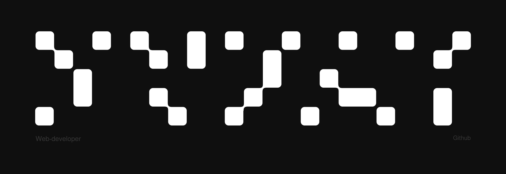

  

<h1 align="center"> svyat1234 </h1>

  <strong>Фронтенд-разработчик</strong>

## ⚪ Обо мне

⚫ Привет! Я Свят. Занимаюсь фронтенд-разработкой.

⚫ Люблю разбираться в сложных задачах, писать чистый код, наводить красоту и постоянно учиться новому. 

⚫ Работаю в компании Code-X wep-development.

⚫ Учавствую в разработке нескольких проектов.

### Технологии и инструменты

  &nbsp;
  &nbsp;
  &nbsp;
  &nbsp; 
  &nbsp; 
  &nbsp;
  &nbsp;
  &nbsp; 
  &nbsp; 
  &nbsp;
  &nbsp;
  

## ⚪ Компания, в которой работаю
***

  

  <strong>Code-X wep-development</strong>

** GitHub статистика **

  
  
  

  

<!--
**svyat1234/svyat1234** is a ✨ _special_ ✨ repository because its `README.md` (this file) appears on your GitHub profile.

Here are some ideas to get you started:

- 🔭 I’m currently working on ...
- 🌱 I’m currently learning ...
- 👯 I’m looking to collaborate on ...
- 🤔 I’m looking for help with ...
- 💬 Ask me about ...
- 📫 How to reach me: ...
- 😄 Pronouns: ...
- ⚡ Fun fact: ...
-->
